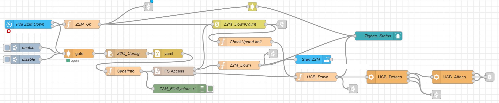

# ZigbeeFailsafe
A zigbee fail-safe for Home Assistant running as a VM on a (QNAP) server.
One of my automations on Home Assistant is Node-Red, which I will use to autmate this fail-safe.

### Assumed is that you have a working Node-Red flow with for example Zigbee2MQTT.

If your setup is different, you should be able to get some insightfull information for your own setup to create a fail-safe.

When:
* If the Zigbee to Mqtt service did stop due to some problem (I use Zigbee2MQTT).
* If the Zigbee router (USB stick) did fail / was "disconnected" from Home Assistant VM.
* If a backup of the VM running Home Assistant is being executed and due to this disconnects the USB stick.
* If your server did / needed to restart.
* ...

Goal is to auto connect / auto start everything:
* After a problem.
* VM was restarted.
* VM is backuped and disconnects the USB Zigbee router.
* ...

Setup developed with:
* QNAP server
* Sonof Zigbee 3.0 USB Donel Plus E router / gateway (EFR32MG21)
* Home Assistant running as a VM
* Zigbee2Mqtt
* Node Red as main automation

There are 2 processes that check and try to restart Zigbee communication: 
* Process that checks if the Zigbee2MQTT is in Stop state and tries to start it again.
* Process that checks if the USB Zigbee connection is still there and if needed reattaches the USB Zigbee connection.


# >> Node-Red flow

The [Json flow file](ZigbeeFlow.json):

The image above only shows the basics, the flow itself has additionals diagnostics and debug functions.

## These are the nodes to be installed additionally via the Palette (if needed)

gate:
* node-red-contrib-simple-gate
sshexec:
* @arcsoft/node-red-sshtools
poll state:
* node-red-contrib-home-assistant-websocket
fs access:
* node-red-contrib-filesystem
state-machine:
* node-red-contrib-persistent-fsm
ui_spacer, ui_group, ui_tab:
* node-red-dashboard
ui_led
* node-red-contrib-ui-led

# >> Check Zigbee2MQTT

Zigbee2MQTT is polled to check if it has stopped and when stopped, it is restarted (except if the gate is manualy closed).

To restart Z2M, the service addon_start is called with the following information

```
{
    "addon": "45df7312_zigbee2mqtt"
}
```

If you go to Setting=>Add-ons and select Zigbee2MQTT, you will see the number and name in the path of your browser
../hassio/addon/45df7312_zigbee2mqtt/..

# >> Check Zigbee router / gateway (USB stick)

If the USB connected is 'disconnected', Zigbee2MQTT will also stop, so only when Zigbee2MQTT is stopped, the USB will be checked. 

USB is checked by checking if '/dev/serial/by-id/usb-ITEAD_SONOFF_Zigbee_3.0_USB_Dongle_Plus_V2_20231219205541-if00' is still there.
In this flow the "/homeassistant/zigbee2mqtt/configuration.yaml" file is examined for the name and then with FS Acces checked if it is there

If USB needs to be Attached, it is first Detached (optional) and then Attached and then again Zigbee2MQTT and USB is checked.

What is needed?
* For Detach and Attach SSH is used, because USB attaching can only be done outside the Home Assistant VM
* SSH properly set on the QNAP server
* An XML USB configuration file

## The XML being called to re-attach the Zigbee USB device
The [z2m_usb_device.xml](z2m_usb_device.xml) file should be accessable outside the VM, in this flow at 
'/share/CACHEDEV1_DATA/VM/Home Assistant/config/z2m_usb_device.xml'

```
<hostdev mode='subsystem' type='usb' managed='yes'>
  <source>
    <vendor id='0x1a86'/>
    <product id='0x55d4'/>
  </source>
</hostdev>
```
vendor id and product id depend on your USB device and easiest to be found out via a SSH session and execute 'lsusb'


# >> Setup QNAP SSH terminal console management
You will need to disable the following, otherwise when doing SSH to the server you will see a menu and not a prompt


You will also need to find out the VM ID, this can be done by going to the VM addon on the server or via SSH '/QVS/usr/bin/virsh list'


# >> Setup SSH Config, needed for sshexec node


Some links that helped me develop / implement the above:
* https://community.home-assistant.io/t/hassio-in-vm-on-qnap-conbee-2-keeps-disconnecting/316866/2
* https://forum.qnapclub.de/thread/48622-usb-auto-reconnect-nach-neustart-des-nas/
* https://www.tweaking4all.com/forum/qnap-nas/qnap-ssh-how-to-disable-the-console-menu-at-login/
* https://forum.qnap.com/viewtopic.php?t=128704
* https://www.reddit.com/r/qnap/comments/6madp5/vm_30_enable_usb_on_vm_after_poweroff/
* https://forum.qnap.com/viewtopic.php?t=100191#p540008
* https://forum.qnap.com/viewtopic.php?t=100191&sid=fd2455598f0c8eee8647a5914724f567&start=15
